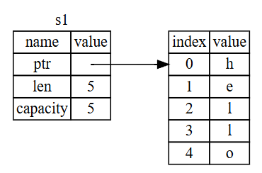
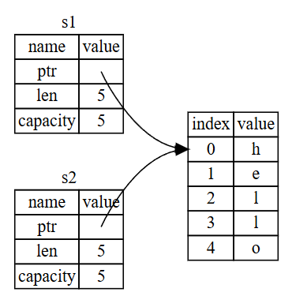

# **Sumário**
1. [A Stack e a Heap](#a-stack-e-a-heap)
2. [Ownership (Posse)](#ownership-posse)
    1. [Regras do Ownership](#regras-de-ownership)
    2. [O escopo de uma variável](#o-escopo-de-uma-variável)
    3. [O Tipo String](#o-tipo-string)
    4. [Memória e Alocação](#memória-e-alocação)
    5. [Variáveis e Dados Interagindo](#variáveis-e-dados-interagindo)
    6. [Escopo e Atribuição](#escopo-e-atribuição)
    7. [Deep Copy](#deep-copy)
        1. [O Método `clone()` em Tipos Escalares](#o-método-clone-em-tipos-escalares)
    8. [Ownership e Funções](#ownership-e-funções)
3. [Referências e Empréstimo de Posse](#referências-e-emprésitmos-de-posse-ownership)
    1. [Multabilidade de Referências](#multabilidade-de-referências)
    2. [Referências Pendentes (*Dangling References*)](#referências-pendentes-dangling-references)
4. [O Tipo "Fatia" (Slice Type)](#o-tipo-fatia-slice-type)
    1. [Fatias de String (String Slices)](#fatias-de-string-string-slices)
        1. [Literais de String como Fatias](#literais-de-string-como-fatias)
    2. [Outras Fatias (Slices)](#outras-fatias-slices)
----

# A Stack e a Heap
Tanto a stack (pilha) quando a heap são partes da memória disponíveis para que o seu programa use quando é executado, mas eles são estruturados de formas bem diferentes.

A stack é exatamente o que o nome diz no sentido de estrutura de dados: ela guarda um *stack frame* para cada função na ordem em que elas são chamadas e os remove na ordem em que a execução dessas funções acaba. Naturalmente, a última função chamada é a primeira que termina de ser executada (não estamos tratando de funções assíncronas e programação concorrente), então isso é um caso de *LIFO (Last in Fist Out)*. Em cada *stack frame* são armazenados os valores das variáveis locais da função associada. Todo dado armazenado na stack deve ter tamanho fixo e estático.

A heap não corresponde à estrutura de dados `heap` e é bem menos organizada. Quando você coloca um dado na heap, você solicita uma certa quantidade de espaço, o alocador encontra um lugar com espaço o suficiente, marca esse lugar como sendo utilizado, e retorna um ponteiro para esse endereço. Isso é chamado alocação (e é o que o `malloc` faz no C). Como um ponteiro tem um tamanho fixo, ele fica guardado na stack.

"Empurrar" na stack é mais rápido do que alocar na heap pois, no segundo caso, o alocador tem que procurar um espaço de memória vazio, enquanto, na stack, basta colocar o valor no topo. Da mesma forma, é mais rápido acessar dados na stack, pois, na heap, é necessário seguir o ponteiro para encontrar o dado.

Quando um programa chama uma função, os valores passados para ela são empurrados para o *stack frame* que acabou de ser criado. Quando a função acaba de ser executada, o *stack frame* é destruído e os valores de variáveis nele também. Dessa forma, não é necessário fazer nada em relação à memória na stack, tudo é resolvido automaticamente ao fim da execução.

Na heap, a memória é um pouco mais complicada. Se um recurso está na heap e o escopo em que esse recurso foi alocado acaba, o ponteiro para ele (que está na stack) é destruído, mas o valor continua na heap a não ser que o seu espaço seja liberado (com `free`, por exemplo, no C). Isso é o que gera os *memory leaks*, a memória continua alocada depois que o programa termina de ser executado.

Veja o exemplo:

```c
#include<stdio.h>
#include<stdlib.h>

int main() {
    int a; // Vai pra stack
    int *p; // O ponteiro também vai pra stack
    // Estamos alocando o espaço para um inteiro na heap
    p = (int*)malloc(sizeof(int));
    *p = 10;
    // Estamos pegando o ponteiro que apontava para o espaço de memória em que estava o 10 e fazendo ele apontar para outro lugar, mas não liberamos o espaço de memória para o qual 'p' apontava antes
    // Consequentemente, haverá um 10 alocado em algum espaço aleatório da memória, ao qual não temos acesso, até que o sistema operacional de um jeito de jogar isso fora
    p = (int*)malloc(sizeof(int));
    *p = 20;
    // Aqui, estamos liberando a memória em que esta alocado o 20
    free(p);
}
```

# Ownership (Posse)
Ownership é um conjunto de regras que define como o Rust gerencia memória a fim de evitar os *memory leaks* explicados. Basicamente, o Rust faz valer para a heap aquilo que já vale para a stack.

## Regras de *Ownership*
1. **Cada valor em Rust tem um *dono***
2. **Cada valor só pode ter um dono por vez**
3. **Quando um dono sai do escopo, o valor é destruído**

## O escopo de uma variável
O escopo de uma variável é o alcance dela no código. Por exemplo:
```rust
{                       // s ainda não foi declarado
    let s: &str = "hello";   // s é valido daqui pra frente
    // brinque com s
} // esse é o fim do escopo de s
```
Esse é um caso trivial com uma variável que fica armazenada na stack (uma string de tamanho estático `str`). Vamos ver como o ownership se comporta com tipos mais complexos e dinâmicos, como a `String`

## O Tipo String
Já vimos muitos literais de strings até então, mas esse tipo não é suficiente para tudo o que queremos fazer com textos em um programa. Muitas vezes, precisamos de dados sobre os quais não sabemos informações como tamanho em tempo de compilação (quando recebemos uma string por meio da entrada de um usuário, por exemplo).

Para isso, existe o tipo `String`. Esse tipo gerencia memória alocada na heap e, portanto, consegue armazenar uma quantidade de texto desconhecida em tempo de compilação. Podemos criar uma `String` por meio de um literal de string utilizando a função `from`:

```rust
let s = String::from("Olá");

s.push_str(", mundo!"); // push_str() incrementa um literal de string a uma String

println!("{s}"); // > Olá, mundo!
```

## Memória e Alocação
A diferença entre um literal de uma string e uma variável do tipo `String` é que o literal já tem tamanho e valor conhecidos em tempo de compilação. Dessa forma, ele pode ser transformado em código de máquina (bytes) em tempo de compilação e gravado executável. Com a variável do tipo `String` o programa precisa solicitar memória e liberar esse espaço de memória após o fim da execução.

O ownership entra nessa segunda etapa: liberação do espaço de memória.

Em linguagens com *garbage collector (GC)*, como Java, Haskell, Python, etc., o GC toma conta disso. Na maioria das linguagens sem GC, como C, C++, etc., a memória deve ser liberada pelo programador. Isso muitas vezes não é feito corretamente, o que gera um problema chamado *memory leak* - basicamente, desperdício de memória.

Em Rust, o ownership é a maneira com que a liberação de memória é tratada. Um espaço de memória é automaticamente liberado quando a sua variável "dona" (*owner*) sai do escopo. Internamente, o que o Rust faz é, assim que a variável sai do escopo, chamar uma função especial chamada `drop` - é nela que o criador de um tipo implementa a lógica para devolução da memória.

> **Informação:** o sistema de ownership do Rust é baseado em um padrão do C++ chamado *Resource Acquisition Is Initialization (**RAII**)*, segundo o qual, ao adquirir recursos - abrir arquivos, conexão com banco de dados, etc. -, devemos encapsulá-los em objetos de classes em que:
> - O construtor adquire o recurso.
> - O destrutor libera o recurso.
>
> Dessa forma, o destrutor da classe é chamado quando o objeto sai do escopo, evitando vazamento de memória.

## Variáveis e Dados Interagindo
Várias variáveis podem interagir com o mesmo dado de diferentes formas em Rust. Vamos analisar como se dá essa interação com variáveis de tipos de tamanho fixo.

```rust
let s1 = "hello";
let s2 = s1;
```
No código acima, `s1` é do tipo ` &str`, ou seja, é uma variável de tamanho fixo, que é, portanto, armazenada na *stack*. Nesse caso, fazer `s2 = s1` é fazer uma cópia do valor em `s1` e conectá-lo à variável `s2`. Mas e se fizermos o mesmo com variáveis do tipo `String`?

```rust
let s1 = String::from("hello");
let s2 = s1;
```

O código é bastante parecido com o anterior, então é natural achar que o mesmo que acontece lá acontece aqui, mas obviamente, não é esse o caso (senão nem estaríamos discutindo isso). Como já foi discutido, `String` é um tipo dinâmico, ou seja, seu valor é armazenado na heap, na stack são guardadas informações não voláteis sobre essa variável. Especificamente no caso da `String`, um ponteiro para o endereço do início do valor na heap, um tamanho e uma capacidade.

<div align="center">

</div>

O ponteiro já foi discutido. O tamanho (*lenght*) é quanta memória, em quantidade de bytes, a `String` ocupa. A capacidade (*capacity*) é o total de memória, em bytes, que a String recebeu do alocador - isso será melhor discutido adiante.

O que de fato ocorre quando fazemos `s2 = s1` no caso da `String` (e dos outros tipos dinâmicos) é que os dados que estão na stack são copiados de uma variável para a outra, mas os que estão na heap não. Dessa forma, no código acima, teríamos `s1` e `s2` na stack com ponteiros apontando para o mesmo espaço de memória na heap - não é exatamente isso que acontece pois há mais um detalhe que será explicado à seguir.

<div align="center">

</div>

Copiar os dados na heap poderia ter um custo muito grande em tempo de execução se eles fossem muito extensos.

> **Note:** o comportamento é o mesmo no caso da `&str` e da `String`, os valores na stack são copiados de uma variável para a outra. A diferença é que, em tipos dinâmicos, os dados na stack são apenas os metadados; os dados - o valor da `String`, por exemplo - estão na heap.

Como sabemos, *ownership* estabelece que o Rust chama automaticamente a função `drop` quando uma variável sai de escopo. Daí, no exemplo acima, quando `s1` e `s2` saíssem de escopo, o Rust chamaria o `drop` duas vezes para liberar o mesmo espaço de memória. Esse é o chamado *double free error*. Para evitá-lo, quando fazemos `let s2 = s1` o Rust desconsidera `s1`, isto é, essa variável deixa de existir e não poderá ser acessada, tentar fazer isso geraria um erro em tempo de compilação. Finalmente, o que de fato acontece quando fazemos `let s1 = s2` em Rust está mostrado na imagem a seguir:

<div align="center">

</div>

Em outras linguagens, a prática de copiar apenas os "metadados" da stack, e não os dados presentes na heap, é chamada de *shalow copy* - em contraste ao *deep copy*, copiar também os dados na heap. Como em Rust, a variável que foi copiada é descartada, chamamos isso de `move` (mover). No exemplo que estamos discutindo, diríamos que `s1` foi movida para `s2`.

Em tipos de tamanho estático, como todo o dado está na stack, fazer uma atribuição de uma variável a outra variável `let s2 = s1` não gera problemas como *double free error*. Nesses casos, portanto, não é necessário apagar os dados que foram copiados na stack, ou seja, não é feito o `move`.

## Escopo e Atribuição
Outro caso em que o `drop` é chamado é quando atribuímos um novo valor à uma variável. Por exemplo,

```rust
let mut s = String::from("hello");
s = String::from("ahoy");

println!("{s}, world!"); // > ahoy, world!
```

Inicialmente, nós criamos a `String` com o valor `"hello"` e ligamos ela à variável `s`. Depois, criamos uma nova `String` com o valor `"ahoy"` e atribuímos ela a `s`. Note que, nesse ponto, a `"hello"` não tem um *owner*, não há nada na stack conectado com esse valor na heap, logo, o Rust chamará a função `drop` nele e a memória será imediatamente liberada.

## Deep Copy
Caso queiramos copiar não apenas os metadados de um tipo dinâmico, mas também os dados na heap, podemos utilizar o método `clone()`.

```rust
let s1 = String::from("hello");
let s2 = s1.clone();

println!("s1 = {s1}, s2 = {s2}");
```

O comportamento, em baixo nível, do sistema ao executar esse código está representdo na imagem a seguir:

<div align="center">

</div>

### O Método clone() em Tipos Escalares
Já vimos que em tipos de tamanho fixo, todo o dado fica guardado na stack e, portanto, fazer `let x = y` não copia apenas os metadados, mas todos os dados, logo não gera nenhum valor na heap sem *owner* e não faz com que `y` seja destruído com `drop`. Então o que acontece se fizermos o que segue?

```rust
let s1 = "hello";
let s2 = s1.clone();
```

Nada de especial! Na verdade, para a maioria dos tipos escalares, uma *deep copy* e uma *shallow copy* são a mesma coisa, logo, o resultado do algoritmo acima é o mesmo de se não usarmos o `clone()`.

Em Rust, existe um trait chamado `Copy` que pode ser colocado em tipos que ficam armazenados na stack. Um tipo em que implementa o trait `Copy` não são movidas, são trivialmente copiadas. O Rust não deixa você anotar um tipo com `Copy` se ele (ou qualquer parte dele) já implementar o trait `Drop`, tentar fazer isso gera um erro em tempo de compilação. Via de regra, qualquer tipo escalar simples implementa `Copy` e qualquer tipo que precise ser alocado ou é um tipo de recurso não implementa.
- Todos os tipos de inteiros
- Os booleanos
- Todos os floats
- O tipo `char`
- Tuplas que só tem tipos que também implementam `Copy`

## Ownership e Funções
É aqui que o *ownership* mais mostra seus efeitos. O mecanismo de passar um valor para uma função é similar ao mecanismo de atribuição de uma variável: tipos estáticos serão copiados e tipos dinâmicos serão movidos. Isso significa que, se enviamos uma variável de tipo `String`, por exemplo, para uma função, essa variável não pode ser usada novamente.

Além disso, o valor de retorno de uma função também é movido para o escopo em que essa função é chamada

```rust
fn main() {
    let s = String::from("olá");

    let saida = concatena_mundo(s);

    println!("{}", saida); // > olá, mundo!
    println!("{}", s); // Erro em tempo de compilação ❌
}

fn concatena_mundo(mut s: String) -> String {
    s.push_str(", mundo!");
    s // s é movido para o escopo em que a função foi chamada
    // Isso implica que `drop` não é chamado para s, mesmo com o fim do escopo da função
}
```

Novamente, para variáveis que implementam o trait Copy, é tudo mais simples. A variável não é movida para o escopo da função; uma cópia dela é enviada.

```rust
fn main() {
    let x = 5;

    let y = soma_cinco(x);

    println!("{}", y); // > 10
    println!("{}", x); // > 5
}

fn soma_cinco(x: i32) -> i32 {
    x + 5
}
```

Se quisermos reutilizar um valor que foi utilizado como argumento de uma função, a função deverá retornar uma tupla que contém esse valor.

```rust
fn main() {
    let s1 = String::from("hello");

    let (s2, len) = calcula_tamanho(s1);

    println!("O tamanho de '{s2}' é {tamanho}.");
}

fn calcula_tamanho(s: String) -> (String, usize) {
    let tamanho = s.len();

    (s, tamanho)
}
```

# Referências e Emprésitmos de Posse (Ownership)
Pela abordagem anterior, sempre que quisermos continuar utilizando um valor que é usado como argumento de uma função, precisamos que ele seja retornado por ela. Isso é muito verboso e demasiado complicado para algo tão simples. Imagine: toda função, teria que retornar uma tupla com todos os seus argumentos, além do possível valor de retorno que ela já teria.

Seria bom se houvesse uma forma de passar argumentos para uma função sem transferir as posses de seus valores e, de fato, há. A solução chama-se **referência**. Uma referência é como um ponteiro: é um endereço que podemos seguir para acessar os dados nele; esses dados, porém, pertencem a outra variável. Diferente de ponteiros, é garantido que uma referência aponta para um valor válido de um tipo específico pelo seu tempo de vida.

```rust 
fn main() {
    let s1 = String::from("olá");

    let tamanho = calcula_tamanho(&s1);

    println!("O tamanho de '{s1}' é {tamanho}.");
}

fn calcula_tamanho(s: &String) -> usize {
    s.len()
}
```

O escopo em que a variável `s` é válida é o mesmo que qualquer parâmetro de função. A diferença é que o valor para que `s` aponta não é destruído (o espaço de memória que o contém não é liberado) quando acaba esse escopo.

Note que, na solução acima, não é necessário retornar uma tupla e a função recebe `&String`. O símbolo `&` indica referência e é utilizado também na chamada da função para criar uma referência a partir de `s1`. O diagrama a seguir mostra como funcionam as referências na memória.

<div align="center">

</div>

A referência é um ponteiro para o ponteiro (na stack) para o dado na heap.

A ação de enviar referências aos outros escopos ao invés de fazer um *move* da posse (ownership) do valor é chamada **Empréstimo de Posse** (*Ownership Borrowing*).

## Multabilidade de Referências
Assim como variáveis, referências são imutáveis por padrão. O código a seguir, por exemplo, não compila!

```rust
fn main() {
    let s = String::from("olá");

    let saida = concatena_mundo(&s);

    println!("{}, mundo!", s);
    println!("{}", saida);
}

fn concatena_mundo(s: &String) -> String {
    s.push_str(", mundo!"); // Erro em tempo de compilação ❌
    s
}
```

A solução também é análoga a quando mexemos com não-referências: utiliza-se a *keyword* `mut`:

```rust
fn main() {
    let s = String::from("olá");

    let saida = concatena_mundo(&mut s); // Enviamos uma referência mutável

    println!("{}, mundo!", s);  // > olá, mundo!
    println!("{}", saida); // > olá, mundo!
}
// Recebemos uma referência mutável
fn concatena_mundo(s: &mut String) -> String {
    s.push_str(", mundo!");
    s
}
```

Referências mutáveis tem uma grande restrição: se há uma referência mutável para um valor, não pode haver outras referências a ele. Essa restrição é necessária para prevenir corrida de dados (*data race*) em tempo de compilação. 

> **O que é corrida de dados?** Corrida de dados ocorre quando múltiplas threads ou processos acessam simultaneamente o mesmo recurso, pelo menos uma delas realiza modificações nesse recurso e não há mecanismo de sincronização de acesso ao dado. Sob essas condições, o comportamento é imprevisível pois não há controle sobre qual processo acessa o dado antes e o resultado do programa depende disso.

Pode-se utilizar chaves para criar um novo escopo e, nele, criar outra referência. Essas referências, porém, não são simultâneas.

```rust
    let mut s = String::from("olá");

    {
        let r1 = &mut s;    
    }

    let r2 = &mut s;
```

Pela explicação de corrida de dados, fica claro que apenas uma referência mutável já é um problema (mesmo que as outras sejam imutáveis), dessa forma, o Rust também não permite múltiplas referências imutáveis se existir uma mutável. O código a seguir também gera erro.

```rust
    let mut s = String::from("olá");

    let r1 = &s; // sem problema
    let r2 = &s; // sem problema
    let r3 = &mut s; // PROBLEMÃO

    println!("{}, {}, e {}", r1, r2, r3);
```

O escopo de uma referência começa onde ela é declarada e continua até o seu último uso; o compilador consegue dizer quando uma referência não é mais usada antes do final do escopo. Dessa forma, o código a seguir compila.

```rust
    let mut s = String::from("olá");

    let r1 = &s; // sem problema
    let r2 = &s; // sem problema
    println!("{r1} e {r2}");
    // As variáveis r1 e r2 não serão mais usadas

    let r3 = &mut s; // sem problema
    println!("{r3}");
```
## Referências Pendentes (Dangling References)
Uma referência pendente ocorre quando um ponteiro aponta para um espaço de memória que foi liberado. Em linguagens como C e C++, com ponteiros, é fácil criar uma referência pendente; o código a seguir mostra um exemplo em C.

```c
int main() {
    int *ptr = (int*)malloc(sizeof(int)); // Alocamos memória na heap para armazenar um inteiro
    *ptr = 100; // Guardamos o valor `100` nesse espaço
    free(ptr); // Desalocamos a memória, mas o ponteiro segue apontando para aquele espaço
    // ptr agora aponta para uma memória inválida
}
```

O Rust impede *dangling references* em tempo de compilação! Se você tem uma referencia a algum dado, o comilador garante que aquele dado não vai sair do escopo antes que a referência a ele saia. Vejamos o que o compilador nos diz quando tentamos criar uma referência pendente.

```rust
fn main() {
    let dangling_reference = dangle();
}

fn dangle() -> &String {
    let s = String::from("olá");

    &s // Aqui, retornamos uma referência à String s, mas sabemos que `drop` será chamado para essa String assim que acabar o escopo da função!
    // Isso criaria uma dangling reference
}
```
O erro retornado é:

```text
$ cargo run
   Compiling ownership v0.1.0 (file:///projects/ownership)
error[E0106]: missing lifetime specifier
 --> src/main.rs:5:16
  |
5 | fn dangle() -> &String {
  |                ^ expected named lifetime parameter
  |
  = help: this function's return type contains a borrowed value, but there is no value for it to be borrowed from
help: consider using the `'static` lifetime, but this is uncommon unless you're returning a borrowed value from a `const` or a `static`
  |
5 | fn dangle() -> &'static String {
  |                 +++++++
help: instead, you are more likely to want to return an owned value
  |
5 - fn dangle() -> &String {
5 + fn dangle() -> String {
  |

error[E0515]: cannot return reference to local variable `s`
 --> src/main.rs:8:5
  |
8 |     &s
  |     ^^ returns a reference to data owned by the current function

Some errors have detailed explanations: E0106, E0515.
For more information about an error, try `rustc --explain E0106`.
error: could not compile `ownership` (bin "ownership") due to 2 previous errors
```
Esse erro trata de *lifetimes*, conceito ainda não discutido. Ignorando essa parte, perceba o trecho `this function's return type contains a borrowed value, but there is no value
for it to be borrowed from`; ele explica perfeitamente o erro: Não podemos retornar uma referência que se refere a nada! (aponta para um espaço de memória vazio).

As regras de referências que vimos até agora são:
- **A qualquer momento no código, pode-se ter *n* referências imutáveis OU uma referência mutável**;
- **Referências devem sempre ser válidas**.

# O Tipo "Fatia" (Slice Type)
Já vimos como usar referências para manipular variáveis, mas será que podemos utilizá-las para manipular "fatias" (sequencias contíguas) de coleções? Por exemplo, na String `String::from("Hello, world!")` talvez queiramos manipular apenas `"world"`, mexendo diretamente no espaço de memória correspopndente a essa "fatia" da `String` original. Será que isso é possível? Sim! E esses são exatamente os `Slices` a que nos referimos!


## Fatias de String (String Slices)
Considere o seguinte exemplo: queremos definir uma função que recebe uma String, possivelmente com palavras separadas por espaço `" "`; queremos retornar a primeira palavra dessa String (caso haja apenas uma, retornamos ela). Sem Slices, podemos retornar o índice do primeiro espaço da String:

```rust
fn primeira_palavra(s: String) -> usize {
    let bytes = s.as_bytes(); // Convertemos a String em um array de bytes

    for (i, &item) in bytes.iter().enumerate() {
        if item == b' ' { return i } // Retornamos o índice do primeiro espaço
    }

    s.len() // Caso contrário, retornamos o próximo índice após o final da palavra
}
```

Pronto! Temos uma forma de recuperar a primeira palavra de uma String. Mas e se a String for modificada? Após a chamada da função `primeira_palavra`, não há nada associando o resultado da sua execução à String `s`; o resultado só faz sentido no contexto da String original, havendo alterações, ele se torna inútil! Considere o código a seguir:

```rust
fn main() {
    let mut s = String::from("Olá, mundo!");

    let palavra = primeira_palavra(&s); // palavra = 5

    s.clear(); // s = ""
    // `palavra` ainda é igual a `5` aqui, mas `s` é uma String vazia!
    // O valor `5` não tem mais nenhum significado, `palavra` é totalmente inválido
}
```

Ficar se preocupando em manter a sincronização entre variáveis auxiliares e a String após cada alteração nela não é legal e é um para-raio de bug (confiar no programador? NUNCA!). Dessa forma, o Rust introduz uma solução idiomática e confiável, fatias de Strings (String Slices)!

Uma String Slice é uma referência a uma porção de uma String
```rust
    let s = String::from("ola, mundo!");
    let ola = &s[0..3]; // ou s[..3]
    let mundo = &s[5..10];
    let s2 = &s[..]; // Toda a String
```
Os Slices, como pode ser visto no código acima, são criados especificando-se o índice de início e o próximo índice após o final desse Slice, esse índices são separados por dois pontos (`..`, não `:`) dentro de colchetes `[]`. O diagrama a seguir representa o que são slices na memória.

<div align="center">

</div>

Vamos reescrever a função `primeira_palavra()` utilizando String Slices. O tipo de um String Slice é `&str`.

```rust
fn primeira_palavra(s: &String) -> &str {
    let bytes = s.as_bytes();

    for (i, &item) in bytes.iter().enumerate() {
        if item == b' ' {
            return &s[..i];
        }
    }

    &s[..]
}
```

Agora, o dado retornado pela função está conectado com a String. Essa interface impede bugs no tratamento dos dados pois gera erros de compilação em casos de má utilização (as referências devem ser sempre válidas!). Considere o exemplo em que o índice se tornava inútil devido ao uso do `.clear()` na abordagem anterior.

```rust
fn main() {
    let mut s = String::from("olá mundo");

    let palavra = primeira_palavra(&s);

    s.clear(); // erro! ❌

    println!("A primeira palavra é: {palavra}");
}
```
Isso gera um erro de compilação! O String Slice `palavra` é uma referência imutável e o método `clear()` pega uma referência mutável de `s`, ou seja, temos uma referência mutável e uma imutável ao mesmo dado! Além disso, referências devem ser SEMPRE válidas e `palavra` se tornaria uma *dangling reference* após o `.clear()`.

### Literais de String como Fatias
Já falamos sobre literais de string e sobre como eles ficam armazenados nos binários do programa. Agora que entendemos Slices, podemos entender melhor como os literais funcionam.
```rust
let s = "Olá, mundo!"; // O tipo de `s` é &str 
```
O tipo de um literal de string é o mesmo de uma fatia de string. Isso ocorre porque um literal de string é uma `fatia` da memória, em que estão os binários do código, dessa forma, para o computador, é a mesma coisa que um `String Slice`. É por isso também que os literais de string são imutáveis: eles são `&str`, referências imutáveis!

### Fatias de String como Parâmetros
Sabendo que se pode pegar "fatias" de literais e de Strings, chega-se a outro aperfeiçoamento do programa `primeira_palavra`: podemos torná-lo mais genérico simplesmente mudando a sua assinatura
```rust
fn primeira_palavra(s: &String) -> &str {}
```
para a seguinte assinatura
```rust
fn primeira_palavra(s: &str) -> &str {}
```
Dessa forma, a função funciona para referências a strings dinâmicas, para slices de strings e para literais de string.

## Outras Fatias (Slices)
As fatias de string, obviamente, são específicas para strings. De fato, porém, fatias podem ser bem mais gerais do que isso. Assim como podemos querer utilizar apenas uma parte de uma string, podemos querer nos referir a uma parte de um vetor; podemos fazer isso como segue:

```rust
let a: [i32] = [1, 2, 3, 4, 5];

let slice: &[i32] = &a[1..3];
```

Essas fatias funcionam como as fatias de string: armazenam referências para o primeiro elemento e o tamanho do slice. Usaremos esse tipo de slice para todo tipo de coleções.